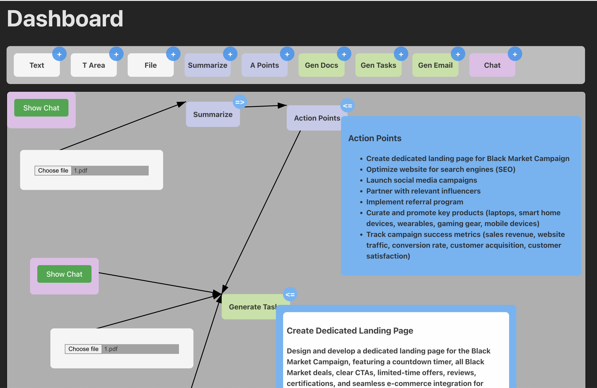
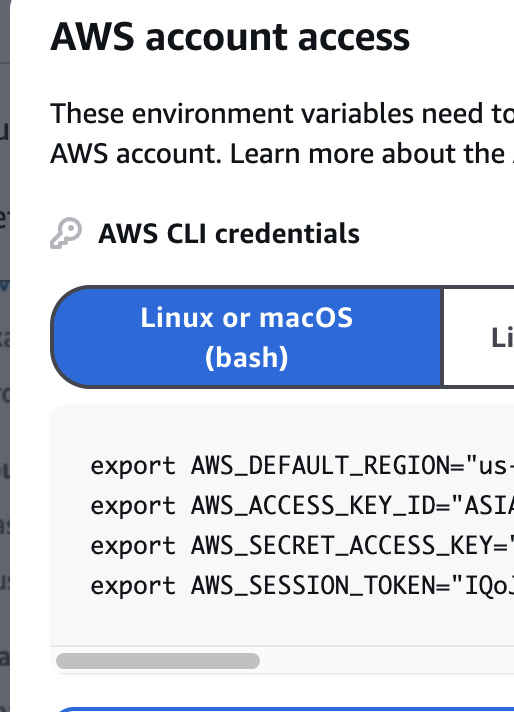

# AI'm Confused Team

## Description


This app is a collaborative dashboard designed to enhance teamwork by isolating, visualizing, and streamlining key project elements. It enables users to upload files, generate summaries, extract actionable points, and collaboratively create task lists or documents in a centralized platform. The app’s visual workflow tools allow team members to focus on specific aspects of a project, ensuring clear prioritization and alignment. With features like chat-based interaction and task generation, it fosters effective communication while providing a visual structure to isolate and address complex matters, making it ideal for managing collaborative campaigns or projects.
[demo video](demo_video.mov)

## Getting Started

### Prerequisites

Before you begin, ensure you have the following installed:

- Node.js
- Docker (for MongoDB container)
- npm (Node Package Manager)

### Installation

#### 1. Install Dependencies

Run the following command to install the required dependencies:

```bash
npm install
```

#### 2. Configure Environment Variables

1. Create a copy of the example environment file:
   ```bash
   cp .env.example .env
   ```
2. Open the `.env` file and fill in the required variables

   > Note: If you need help with the values, please contact our team.

   Also make sure to do the following step
   

#### 3. Set up MongoDB

Start the MongoDB container using Docker Compose:

```bash
docker-compose up
```

### Running the Application

To start the application in development mode, use:

```bash
npm run start:dev
```

Once started, the application will be available at `http://localhost:3000/api` (default port).

---

For additional support or questions, please contact the AI'm Confused Team.
